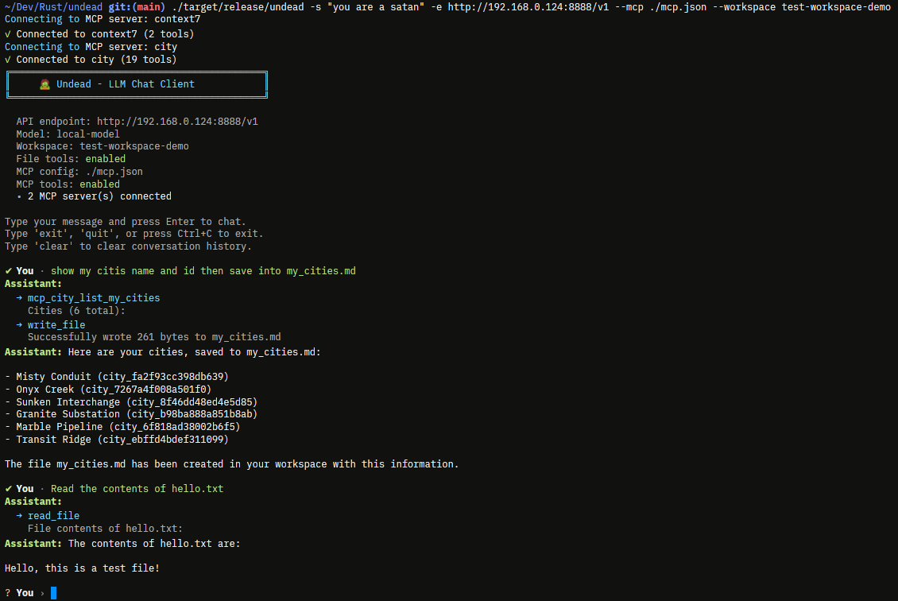

# 🧟 Undead

A minimal CLI chat client for OpenAI-compatible APIs with workspace and MCP support.

[](https://www.rust-lang.org)
[](LICENSE)
[]()
[](https://github.com/skorotkiewicz/undead/actions/workflows/build.yml)



## Installation

### Arch Linux (AUR)

You can install `undead` from the AUR using your favorite helper:

```bash
yay -S undead
# or
paru -S undead
```

### From Source

```bash
cargo build --release
```

## Usage

```bash
# Basic usage
./undead

# With custom endpoint
./undead --endpoint http://localhost:11434/v1 --model llama2

# With OpenAI API
./undead --endpoint https://api.openai.com/v1 --api-key sk-your-key --model gpt-4

# With workspace (file operations)
./undead --workspace ./my-project

# With MCP servers
./undead --mcp ./mcp.json

# With MCP servers amd workspace
./undead --endpoint http://localhost:8080/v1 --mcp ./mcp.json --workspace ./my-project
```

## Options

| Option | Default | Env | Description |
|--------|---------|-----|-------------|
| `-e, --endpoint` | `http://localhost:8080/v1` | `UNDEAD_ENDPOINT` | API endpoint |
| `-m, --model` | `local-model` | `UNDEAD_MODEL` | Model name |
| `-k, --api-key` | - | `UNDEAD_API_KEY` | API key |
| `-s, --system` | `You are a helpful assistant.` | `UNDEAD_SYSTEM` | System prompt |
| `-t, --temperature` | `0.7` | `UNDEAD_TEMPERATURE` | Temperature (0.0-2.0) |
| `-T, --max-tokens` | `2048` | `UNDEAD_MAX_TOKENS` | Max tokens |
| `-w, --workspace` | - | `UNDEAD_WORKSPACE` | Workspace directory |
| `-c, --mcp` | - | `UNDEAD_MCP` | MCP config file |
| `-C, --config` | - | `UNDEAD_CONFIG` | Config file path |
| `-p, --preset` | - | `UNDEAD_PRESET` | Preset name |

## Config & Presets

Use a config file to manage multiple API configurations:

```bash
# Use config with preset
./undead -C ./config.yml -p mylocal

# Use config without preset (uses global values)
./undead -C ./config.yml
```

**Config file format (`config.yml`):**

```yaml
# Global defaults
UNDEAD_ENDPOINT: "https://openrouter.ai/api/v1"
UNDEAD_MODEL: "x-ai/grok-4-fast"
UNDEAD_API_KEY: ""
UNDEAD_SYSTEM: ""
UNDEAD_TEMPERATURE: ""
UNDEAD_MAX_TOKENS: ""
UNDEAD_WORKSPACE: ""
UNDEAD_MCP: ""
UNDEAD_CONFIG: ""
UNDEAD_PRESET: ""

presets:
  "mylocal":
    UNDEAD_ENDPOINT: "http://192.168.0.124:8888/v1"
    UNDEAD_MODEL: "local-model"
    
  "openrouter":
    UNDEAD_ENDPOINT: "https://openrouter.ai/api/v1"
    UNDEAD_MODEL: "x-ai/grok-4-fast"
```

**Priority:** CLI args > Config preset > Config global > Environment variables > Defaults

## Workspace

Enable file operations within a directory:

```bash
./undead --workspace ./src
```

**Available tools:**
- `read_file` - Read file contents
- `write_file` - Write/create files
- `edit_file` - Edit files with precise string replacement
- `create_directory` - Create directories
- `delete_file` - Delete files
- `delete_directory` - Delete directories
- `list_directory` - List directory contents
- `execute` - Execute shell commands in the workspace

All operations are sandboxed to the workspace directory.

**Note:** The `execute` tool requires user confirmation before running any command. You will be prompted with `Run? (y/N):` and must type `y` to proceed.

## Agent Directory

When a workspace is configured, undead automatically reads all `*.md` files from the `.agent/` directory to customize the agent's behavior. If the directory doesn't exist, it will be created.

```bash
./undead --workspace ./my-project
# Reads from ./my-project/.agent/*.md or creates the directory
```

**Example `.agent/` directory:**

```
my-project/
├── .agent/
│   ├── persona.md      # "You are a senior Rust developer"
│   ├── skills.md       # "Code review, refactoring, documentation"
│   └── context.md      # "This is a CLI tool for AI chat"
└── src/
    └── ...
```

All `*.md` files are automatically loaded and appended to the system prompt when the workspace is active. Each file becomes a section with the filename as the header.

## MCP

Connect to Model Context Protocol servers for extended capabilities:

```json
{
  "mcp_servers": {
    "city": {
      "type": "remote",
      "url": "https://mcp.example.com/mcp?key=sk_5af",
      "enabled": true
    },
    "context7": {
      "command": "bunx",
      "args": ["-y", "@upstash/context7-mcp", "--api-key", "ctx7sk-..."],
      "enabled": true
    },
  }
}
```

**Local servers:** `type: "local"`, `command`, `args`, `env`  
**Remote servers:** `type: "remote"`, `url`

## Interactive Commands

- `exit`, `quit`, `q` - Exit
- `clear` - Clear history
- `\e` - Open editor for multi-line input
- `Ctrl+C` - Cancel current generation
- `Ctrl+D` - Exit

Type `\e` to open your default editor where you can write multi-line messages. When you save and close the editor, the content is sent to the LLM.

**Editor selection priority:**
1. `$EDITOR` environment variable
2. `$VISUAL` environment variable
3. Platform default: `vim` (macOS), `nano` (Linux), `notepad` (Windows)

## Compatible APIs

Works with any OpenAI-compatible API:
- llama.cpp
- Ollama
- vLLM
- LocalAI
- OpenAI
- Azure OpenAI

## License

MIT
