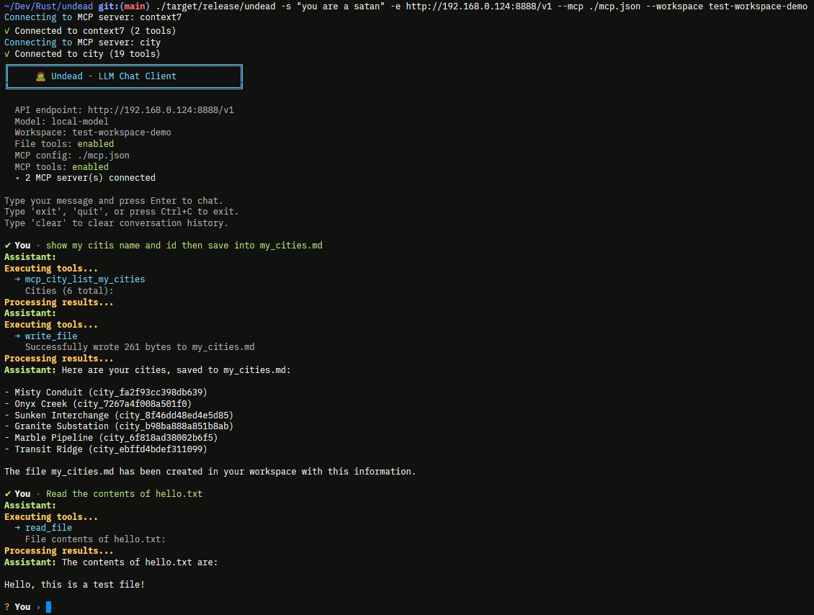

# 🧟 Undead

A minimal CLI chat client for OpenAI-compatible APIs with workspace and MCP support.



## Installation

```bash
cargo build --release
```

## Usage

```bash
# Basic usage
./undead

# With custom endpoint
./undead --endpoint http://localhost:11434/v1 --model llama2

# With OpenAI API
./undead --endpoint https://api.openai.com/v1 --api-key sk-your-key --model gpt-4

# With workspace (file operations)
./undead --workspace ./my-project

# With MCP servers
./undead --mcp ./mcp.json

# With MCP servers amd workspace
./undead --endpoint http://localhost:8080/v1 --mcp ./mcp.json --workspace ./my-project
```

## Options

| Option | Default | Env | Description |
|--------|---------|-----|-------------|
| `-e, --endpoint` | `http://localhost:8080/v1` | `UNDEAD_ENDPOINT` | API endpoint |
| `-m, --model` | `local-model` | `UNDEAD_MODEL` | Model name |
| `-k, --api-key` | - | `UNDEAD_API_KEY` | API key |
| `-s, --system` | `You are a helpful assistant.` | `UNDEAD_SYSTEM` | System prompt |
| `-t, --temperature` | `0.7` | `UNDEAD_TEMPERATURE` | Temperature (0.0-2.0) |
| `-T, --max-tokens` | `2048` | `UNDEAD_MAX_TOKENS` | Max tokens |
| `-w, --workspace` | - | `UNDEAD_WORKSPACE` | Workspace directory |
| `-c, --mcp` | - | `UNDEAD_MCP` | MCP config file |

## Workspace

Enable file operations within a directory:

```bash
./undead --workspace ./src
```

**Available tools:**
- `read_file` - Read file contents
- `write_file` - Write/create files
- `create_directory` - Create directories
- `delete_file` - Delete files
- `delete_directory` - Delete directories
- `list_directory` - List directory contents

All operations are sandboxed to the workspace directory.

## MCP

Connect to Model Context Protocol servers for extended capabilities:

```json
{
  "mcp_servers": {
    "city": {
      "type": "remote",
      "url": "https://mcp.example.com/mcp?key=sk_5af",
      "enabled": true
    },
    "filesystem": {
      "type": "local",
      "command": "mcp-server-filesystem",
      "args": ["--root", "/home/user/docs"],
      "enabled": true
    }
  }
}
```

**Local servers:** `type: "local"`, `command`, `args`, `env`  
**Remote servers:** `type: "remote"`, `url`

## Interactive Commands

- `exit`, `quit`, `q` - Exit
- `clear` - Clear history

## Compatible APIs

Works with any OpenAI-compatible API:
- llama.cpp
- Ollama
- vLLM
- LocalAI
- OpenAI
- Azure OpenAI

## License

MIT
